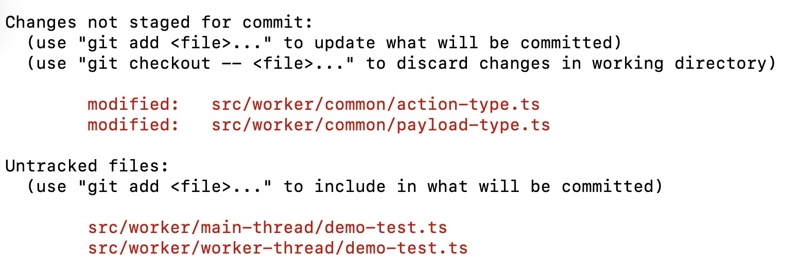
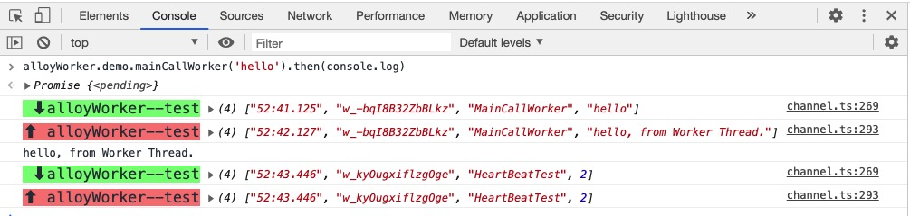

# alloy-worker 使用教程

Alloy-worker 对原始 Web Worker 通信能力进行了 RPC 封装,  **约定了 Worker 代码的组织方式和调用方式**. 初始化源码后, Web Worker 就是项目的一项基础能力, 你也可以自由地去使用和修改它.

## 实例化 alloy-worker

Alloy-worker 对外的 API 是 `createAlloyWorker` -- 实例化 AlloyWorker 的工厂函数. 在主线程使用 Worker 能力的代码处, 引入和实例化 alloy-worker.

```js
// src/index.ts

import createAlloyWorker from 'path/to/worker/index';

// 实例化 AlloyWorker
const alloyWorker = createAlloyWorker({
    workerName: 'alloyWorker--test', // 必要参数, 设置 worker 实例名称, 用于区分多个实例.
    isDebugMode: false, // 可选参数, 是否为调试模式, 默认为 false. 为 true 时控制台会输出每次通信的数据流信息.
});
```

## 发起跨线程调用

在 alloy-worker 的约定里, 通过事务(action)进行跨线程通信, 同类事务聚合为命名空间(namespace), 命名空间作为 `alloyWorker` 的属性来访问.

### 主线程调用 Worker 线程

```js
// src/index.ts

// Worker 线程计算请求从发送到接收的时间差, 将时间差返回主线程.
alloyWorker.workerAbilityTest.communicationTest()
    .then((res) => console.log(`worker test result: ${res}`)); // worker test result: 136
```

其中:
* `workerAbilityTest` 为事务命名空间, 表示 Worker 能力测试的事务集合.
* `communicationTest` 为具体事务, 表示通信测试的事务.
* 调用 `communicationTest(opts)` 会发起一次跨线程通信, `opts` 为通信负载.
* 跨线程通信是 Promise 化的, 在 `.then` 中返回通信的结果.

### Worker 线程调用主线程

```js
// src/worker/worker-thread/index.ts

// 主线程获取页面的 cookie 信息, 并返回给 Worker 线程
this.cookie.getCookie().then((payload) => {
    console.log('document cookie:', payload);
}); // document cookie: xsrf=alloy,token=worker
```

其中:
* `cookie` 为事务命名空间, 表示 Cookie 相关的事务集合.
* `getCookie` 为具体事务, 表示获取 cookie 的事务.

---
> 想了解 alloy-worker 如何封装通信为 Promise, 请查看 [alloy-worker 技术细节](./alloy-worker%20%E6%8A%80%E6%9C%AF%E7%BB%86%E8%8A%82.md).

## 添加新事务

开发 Worker 侧业务时, 需对齐 alloy-worker 的约定.

### 事务生成脚本
为快速地新增符合约定的事务, alloy-worker 提供了事务生成脚本. 调用方式如下:

```sh
$ node ./src/worker/one-script/index.js demo-test
输入的事务名称: demo-test.
事务的纯字母名称: DemoTest.

...
新增事务模板代码完成.
请修改事务的 action, payload 类型声明, 并编写业务逻辑.
```

其中:
* `src/worker/one-script/index.js` 为生成脚本入口.
* `demo-test` 为新增事务的命名空间名称. 合法的命名空间名称为: 字母, `_`, `-` 的组合, 如 `worker-ability-test`, `cookie` 等.

建议将脚本调用添加到 package.json 的 `scripts` 中, 方便通过 `npm run xxx` 调用.

### 新事务代码结构

生成新事务模板后, 改动的源码主要包括 4 个文件, 如下图所示.



其中:
* `action-type.ts` 包含新事务的类型声明.
* `payload-type.ts` 包含新事务的发送负载声明和响应负载声明.
* `worker/main-thread` 为主线程源码目录, `worker/worker-thread` 为 Wokrer 线程源码目录.
* 主线程目录和 Worker 目录下有同名的 `demo-test.ts`, 为事务发送函数和事务处理函数.

### 调用新增事务
这里仅做示例, 编辑业务逻辑后调用函数名称会变.

* 主线程调用 Worker 线程
```js
// src/index.ts

alloyWorker.demoTest.mainCallWorker('hello').then(console.log); // hello, from Worker Thread.
```

* worker 线程调用主线程
```js
// src/worker/worker-thread/index.ts

this.demoTest.workerCallMain({
    hello: 100,
    world: 200,
}).then(console.log); // {alloy: "100", worker: "200"}
```

### 编写业务逻辑

对事务模板代码进行修改, 以适应真实的业务场景. 修改时可以先了解下 [alloy-worker 代码约定][alloy-worker 代码约定].

## 不兼容提示

根据 AlloyTeam 的实践经验, Worker 有大约 99.9% 的可用性, 但你可能更关注 0.1% 不可用的场景. Alloy-worker 内置可用性监控能力, 可以在 Worker 不可用时提示用户.

修改 `src/worker/heart-beat-check.ts` 的 `showDeadTip` 给出 UI 提示:

```js
showDeadTip(): void {
    ...
    alert('Worker 能力不可用, 请使用新版本的浏览器.');
}
```

## 日志上报和错误上报

Alloy-worker 实现了完整的可用性监控和全周期的错误监控. 在现网环境可能需要将监控信息和错误信息上报到分析平台. 

上报收归在 `src/worker/report-proxy.ts` 中, 包括三种上报类型:

### raven
**错误上报**, 主要为 Worker 线程创建和运行的相关报错, 可上报到 sentry 等错误监控平台.
```js
function raven(errorSource, error): void {
    console.error('Raven 上报错误:', errorSource, error);
}
```

### weblog
**日志上报**, 主要为 worker 可用性日志, 如可用性指标, 通信超时, 心跳包超时/停止等.
```js
function weblog(log: any): void {
    console.log('%cWeblog 上报:', 'color: orange', log);
}
```

### monitor
**监控点上报**, 主要为 alloy-worker 创建和运行的关键节点, 只上报节点 id, 用于对接告警平台.
```js
function monitor(monitorId: WorkerMonitorId): void {
    console.log('%cMonitor 上报:', 'color: orange', monitorId);
}
```

## 调试模式

`createAlloyWorker` 的 `isDebugMode: true` 设置 alloy-worker 为调试模式. 调试模式下跨线程通信的数据流会在控制台中输出. 



如上图所示: 
* 每行信息包括: 线程名称, [时间戳, 会话 Id, 事务类型, 事务负载].
* 绿色的向下箭头(`⬇`)表示 Worker 线程收到的信息.
* 粉红的向上箭头(`⬆`)表示 Worker 线程发出的信息.

请不要在生产环境开启调试模式.

## 其他问题

Alloy-worker 已经是你项目源码的一部分, 你可以任意去改造它, 一些没有详细展开的细节点建议走读代码了解. 如果遇到其他问题, 请给我们提 issue.

[alloy-worker 代码约定]: ./alloy-worker%20%E4%BB%A3%E7%A0%81%E7%BA%A6%E5%AE%9A.md

## EOF
