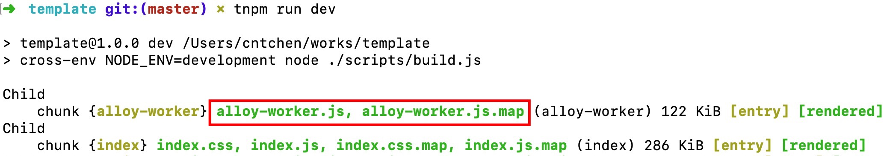
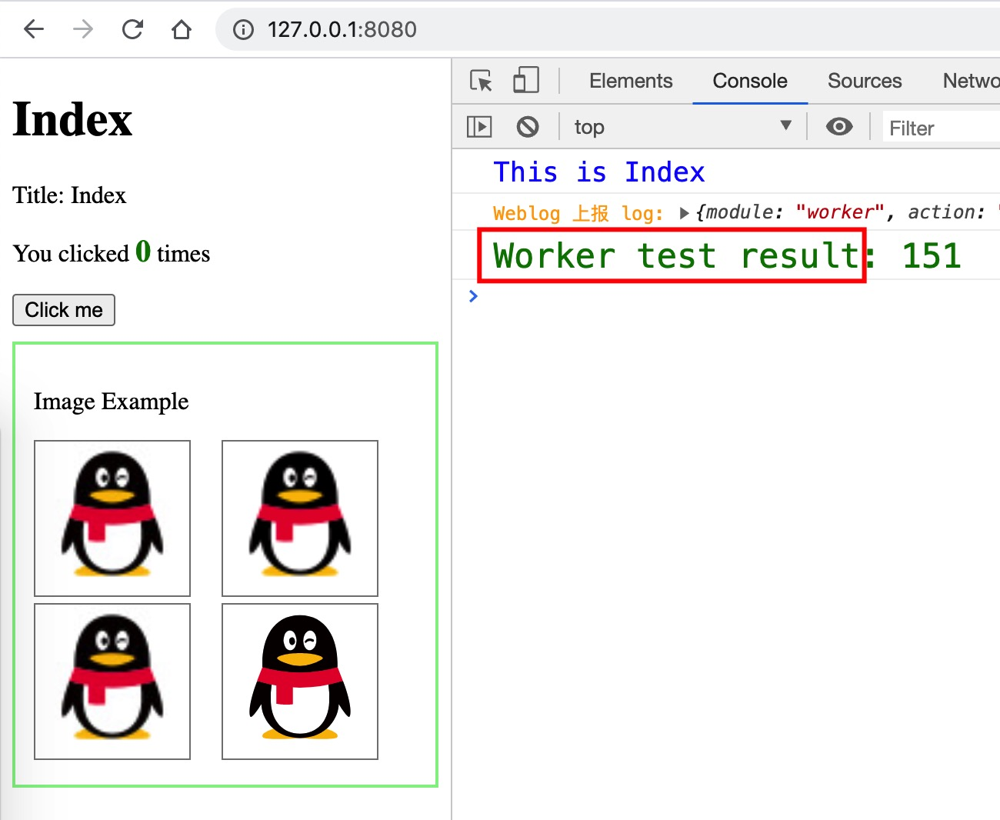

# alloy-worker 接入教程

前端业务中, 需将 Web Worker 的业务代码打包为独立文件. 所以 alloy-worker **并不是一个 npm 包**. 需要你手动将它融合到你的项目里, 并成为**项目源码的一部分**. 好在手动也不复杂, 而且不会影响现有业务.

## 接入前提

Alloy-worker 源码基于 TypeScript 编写, 使用 Webpack4 构建. 这对项目有 2 点要求: 

* 项目需支持 TypeScript 代码构建. 如果未支持, 可以先接入, 在接入过程中解决 ts 构建报错.
* 项目使用非 Webpack4 版本可能会出现构建报错.

以 github 上名为 [template](https://github.com/CntChen/template) 的项目为例, 了解如何接入 alloy-worker.

## 下载源码
将 `template` 和 `alloy-worker` clone 到本地同级目录.

```sh
$ cd /path/to/test
$ git clone https://github.com/CntChen/template.git
$ git clone https://github.com/AlloyTeam/alloy-worker.git
```

## 复制 Worker 源码

Worker 源码在 `alloy-worker/src/worker` 目录, 复制该目录到 `template` 的相同目录.

```sh
$ cd /path/to/test
$ cp -r ./alloy-worker/src/worker ./template/src/
```
## 复制 Worker 类型声明

Alloy-worker 的 TypeScript 类型声明在 `alloy-worker/src/typings/worker.d.ts` 中. 复制该文件到 `template` 的相同目录.

```sh
$ cd /path/to/test
$ mkdir -p template/src/typings
$ cp ./alloy-worker/src/typings/worker.d.ts ./template/src/typings/
```

如果类型声明查找目录未包括 `./src/typings`, 需在 `tsconfig.json` 中添加.

```diff
{
    "typeRoots": [
+       "./src/typings",
        "./node_modules/@types"
    ]
}
```

## 复制构建脚本

项目构建中的 Worker 需要打包为独立的 js 资源, 因此 `alloy-worker` 提供了独立打包的 webpack 配置. 构建脚本在 `alloy-worker/worker-script`, 将该目录复制到 `template` 中.

```sh
$ cd /path/to/test
$ cp -rf alloy-worker/worker-script ./template/
```

有 2 项配置需要对齐项目的配置, 在 `worker-script/project.config.js` 中:

* `outputPath`: Worker 构建输出目录, 默认是 `./dist`; 如果项目使用了其他输出目录, 需要对齐项目.
* `isProduction`: 用于区分构建模式, 默认判断方式是 `process.env.NODE_ENV === 'production'`; 需对齐项目的判断方式.

## 添加 Worker 构建

项目原来的构建称为主线程构建, 把 Worker 构建添加到主线程构建流程. 将 alloy-worker 的构建配置也作为创建 webpack compiler 的参数.

在 tempalte 中修改 `template/script/build.js`.

```diff
+ const preWorkConfig = require('../worker-script/worker.webpack.config');
- const preWorkConfig = undefined;
const webpackConfig = ...

const compiler = webpack([preWorkConfig, webpackConfig].filter(c => !!c));
```

 **Worker 配置需放在主线程配置前**, 因为主线程构建依赖 Worker 构建出来的 js 文件.

## 主线程构建添加 plugins

接入 alloy-worker 后, 主线程构建需添加一些 webpack plugin.

在 `template` 中修改 `template/script/get-webpack-config.js`.

```diff
+ const PluginForMainThreadBuild = require('../worker-script/plugin-for-main-thread-build');

const webpackConfig = {
    plugins: [
+        ...PluginForMainThreadBuild,
    ],
};
```

添加的 plugins 用于解决 2 个问题:
* 主线程通过 Worker 资源 url 使用 Worker, 需要知道 Worker js 名称, 特别是生产构建后文件名会带 hash.
* 主线程和 Worker 线程同构代码需要区分环境, 使用 `webpack.DefinePlugin` 的构建变量 `__WOKRER__` 区分.

## 创建 alloy-worker

在主线程引入 alloy-worker, 实例化和调用 alloy-worker. 参考 `template/src/template/index.ts`.

```js
import createAlloyWorker from '../worker/index';

// 创建 AlloyWorker 实例
const alloyWorker = createAlloyWorker({
    workerName: 'alloyWorker--test',
});

// 发起第一次调用
alloyWorker.workerAbilityTest.communicationTest()
    .then((res) => console.log(`%cWorker test result: ${res}`, 'color: green; font-size: 20px'));
```

## 跑构建

Alloy-worker 构建脚本依赖一些 npm 包, 跑构建前先安装一下.

```sh
$ npm i webpack-manifest-plugin -D
```

终于可以愉快地开始构建.
```sh
// dev
$ npm run dev
// dist
$ npm run dist
```

当你看到下图的输出, 表明你的项目已经实现 Worker 资源的构建!



## 查看接入是否成功

在浏览器中调试项目页面:

```sh
$ cd ./template
$ http-server -c0 ./dist
Available on:
  http://127.0.0.1:8080
```

打开控制台, 如果看到下图的 log. 恭喜你! 你的项目已经成功接入 alloy-worker.



到此, 你的项目已经具备 Worker 能力, 怎么使用 alloy-worker, [请看这里](./alloy-worker%20%E4%BD%BF%E7%94%A8%E6%95%99%E7%A8%8B.md).

## 可能遇到的问题

### TypeScript 报错

Alloy-worker 的 ts 规则可能和项目里的不一致, ts check 可能报错. 如果遇到需要手动修复一下.

### 代码转译

Alloy-worker 项目本身采用 Babel7 + browserslist + core-js 实现按需 transpile/polyfil.

接入后, alloy-worker 已经成为你项目源码的一部分, 所以 ES6+ 源码的 transpile/polyfill 由项目接管. 主要关注主线程和 Worker 线程中的 `Promise` 和 `async/await` 在目标浏览器(如 IE10)的运行情况.

### 其他问题
如果遇到其他接入问题, 请给我们提 issue.

## EOF
